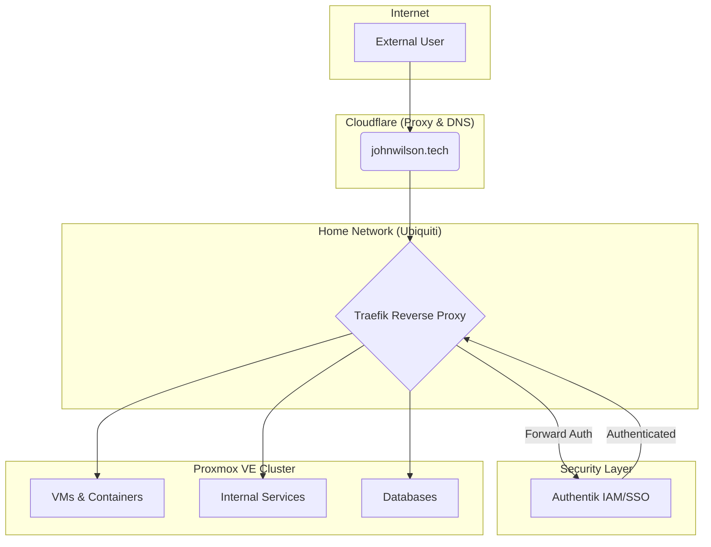

# John's Digital Proving Ground: A Home Lab Exploration

Welcome to my home lab! This is more than just a collection of servers; it's a living, breathing production environment dedicated to continuous learning, security research, and solving real-world problems with modern IT and DevOps principles.

### Philosophy

My approach to this lab is guided by three core principles:

1. **Business Continuity First:** The network must be 100% stable and secure for critical tasks, like supporting my wife's remote work. Uptime is not optional.
    
2. **Security by Design:** The architecture is built on a multi-layered security model, implementing Zero Trust principles like strong identity and device authentication from the network edge to the application level.
    
3. **Automate Everything:** If a task has to be done more than once, it should be automated. The goal is a resilient, repeatable, and easily managed infrastructure.
    

### High-Level Architecture

This diagram illustrates the flow of traffic and the core security layers of the lab. All external traffic is proxied through **Cloudflare, which enforces strict mTLS client certificate authentication at the edge**, blocking unauthorized devices before they can reach my network. For authorized traffic, Traefik manages ingress, and Authentik handles granular, user-level identity and authorization for each service.

### The Tech Stack

#### Hardware & Virtualization

|Component|Make/Model|Role / Purpose|
|---|---|---|
|**Primary Hypervisor**|Lenovo ThinkStation P520|Main Proxmox VE node. Hosts critical services and TrueNAS.|
|**Secondary Hypervisor**|ThinkPad T14 Gen 1|Secondary Proxmox VE node. Hosts redundant services & PBS.|
|**Planned Upgrade**|Custom Build (Ryzen 5 9600X, 64GB DDR5 ECC)|**(In Staging)** Future primary node in Fractal Define R5 case.|
|**Storage (Primary)**|5x 12TB HDDs in ZFS|Bulk storage for media, backups, and archives, managed by TrueNAS.|

#### Networking & Edge Security

|Component|Make/Model|Role / Purpose|
|---|---|---|
|**Edge Security**|Cloudflare|DNS, caching, proxy, and **mTLS client certificate enforcement**.|
|**Gateway / Router**|Ubiquiti UCG Fiber|Core routing, firewall, and traffic management.|
|**Switches**|Ubiquiti USW Flex (2.5G/10G) & USW Flex Mini|Manages network traffic and VLANs across the infrastructure.|
|**Wireless**|2x Ubiquiti U7 Wall Pro APs|Provides segmented Wi-Fi access for Primary, Guest, and IoT networks.|

#### Software & Services

|Component|Technology|Role / Purpose|
|---|---|---|
|**Virtualization**|Proxmox VE|Type-1 Hypervisor for managing all VMs and LXC containers.|
|**Containerization**|Docker & Docker Compose|Standard for deploying and managing all 40+ self-hosted applications.|
|**Identity Mgmt**|Authentik|Centralized IAM/SSO and forward-auth for all critical services.|
|**Reverse Proxy**|Traefik|Manages all ingress traffic, provides automatic SSL, and integrates with Authentik.|
|**Data Protection**|Proxmox Backup Server|Provides centralized, deduplicated, and incremental backups for all VMs.|
|**Network Storage**|TrueNAS|Manages the ZFS storage array and provides network shares (NFS/SMB).|
|**Home Automation**|Home Assistant OS|Core of all smart home devices and automations.|

### Projects & Documentation (After-Action Reports)

This section serves as a living document and a portfolio of completed projects.

- **[Deployment] Proxmox Backup Server & Architectural Hardening** - `(Complete: Sept 2025)`
    
    - _Read the full AAR here:_ [`./project-pbs-deployment-2025-09/PBS_Deployment_AAR.md`](https://www.google.com/search?q=./project-pbs-deployment-2025-09/PBS_Deployment_AAR.md "null")
        
- **[OS Admin] In-Place Upgrade from Debian 12 to 13** - `(Complete: Sept 2025)`
    
    - _Read the full AAR here:_ [`./project-debian-upgrade-2025-09/Debian_Upgrade_AAR.md`](https://www.google.com/search?q=./project-debian-upgrade-2025-09/Debian_Upgrade_AAR.md "null")
        
- **[Migration] Primary Server Hardware Refresh (P520 to Fractal)** - `(In Progress)`
    
    - _AAR to be published upon completion._
        

### The Roadmap: What's Next?

This lab is never "done." My focus for the near future includes a deeper dive into modern DevOps and Infrastructure as Code (IaC) principles.

- [ ] **Expand Crowdsec Deployment:** Move from a single-node instance to a full, multi-node deployment for cluster-wide intrusion detection.
    
- [ ] **Implement Docker Overlay Network:** Architect a scalable overlay network to enable cross-node communication for services like Traefik and Crowdsec.
    
- [ ] **Introduce Infrastructure as Code (IaC):** Begin adopting **Terraform** to manage and provision infrastructure, starting with codifying the Authentik configuration.
    
- [ ] **Build a Basic CI/CD Pipeline:** Implement a Gitea Actions workflow to automate container image updates and deployments.
    
- [ ] **Begin Research into Orchestration:** Start initial labbing and proof-of-concept work with **Kubernetes (k3s)**.
